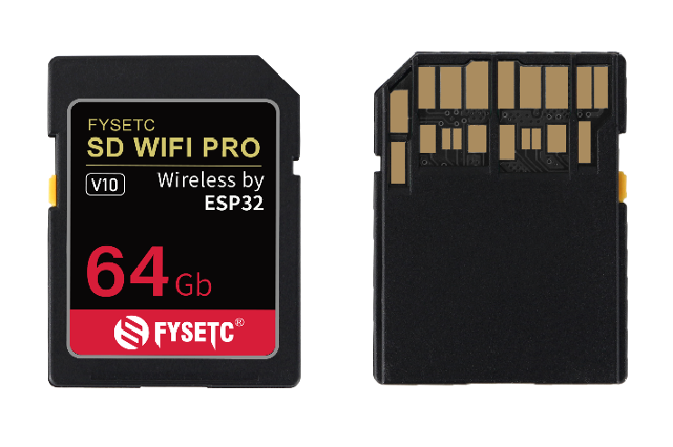
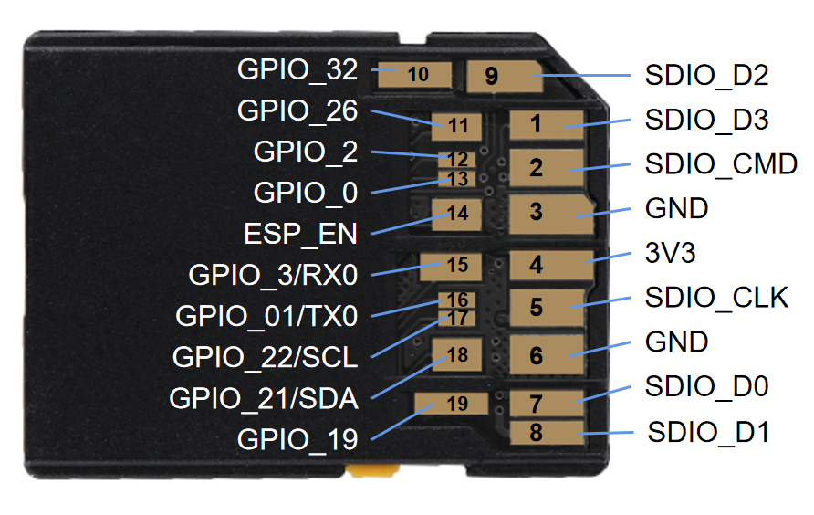
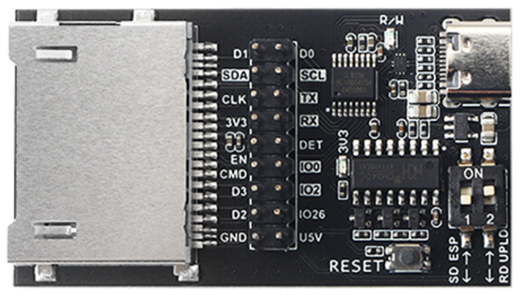
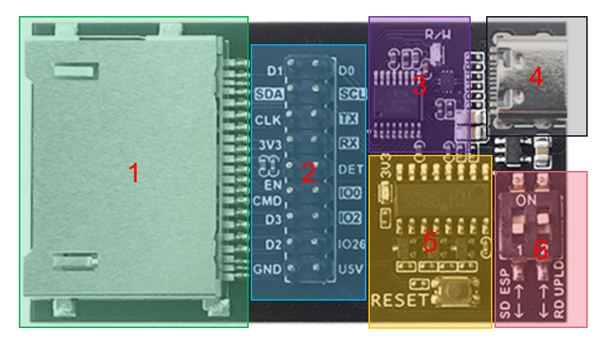

# SD WIFI PRO

## 1. Introduction

This is a brand new SD WIFI, we call it SD WIFI PRO, or SWP for short. It is based on ESP32 PICO V3-02 and SD 7.0 size standard, with additional 8MB Flash, 2MB PSRAM, which can provide more possibilities for more creative applications.
By default, we provide a set of open source and available websever firmware, which has complete file upload and download functions, and can basically meet the needs of remote management files in the LAN.
In addition to the necessary SD transmission pins, SWP also leads out redundant pins. In addition to being used for firmware updates, it can also be used for other device control through the serial port/I2C, so as to realize remote upload files, send control commands and many other operations.
It can also be used in scenarios other than 3D printing, such as Flash Air (TOSHIBA), ez Share (Ez Share) and other products on the market, for file sharing, such as quickly transferring photos in the camera without a data cable to the phone.
It is not only a completely open source product, but also a wireless SD product development kit, which provides more possibilities according to your imagination.

## 2. Feature

- Based on ESP32 PICO D4, with additional 4MB Flash
- 2.4G Wifi & Bluetooth
- SD 7.0 size standard, SDIO/SPI compatible golden finger, and additional serial port and I2C interface
- Built-in 8GB high-speed memory
- Comes with SD Reader and Flash Uploader development board
- Fully open source hardware and software

## 3. Application

3D printers, and other devices that require wireless access to SD cards.

## 4. Hardware Guide

### 4.1 Pin Functions

| Pin  |       Name        | Input     | Output | Function                                                     |
| ---- | :---------------: | --------- | ------ | ------------------------------------------------------------ |
| 1    |      SDIO_D3      |           |        | Built-in Flash pin, SPI: CS                                  |
| 2    |     SDIO_CMD      |           |        | Built-in Flash pin, SPI:MOSI                                 |
| 3    |        GND        |           |        | Ground                                                       |
| 4    |        3V3        |           |        | 3.3V power supply voltage for SWP（3.0-3.6V @300mA+）        |
| 5    |     SDIO_CLK      |           |        | Built-in Flash pin, SPI: CLK                                 |
| 6    |        GND        |           |        | Ground                                                       |
| 7    |      SDIO_D0      |           |        | Built-in Flash pin, SPI: MISO                                |
| 8    |      SDIO_D1      |           |        | Built-in Flash pin, SPI: NC                                  |
| 9    |      SDIO_D2      |           |        | Built-in Flash pin, SPI:NC                                   |
| 10   |      GPIO_32      | OK        | OK     | ADC1_CH4, TOUCH9,  RTC_GPIO9                         |
| 11   |      GPIO_26      | Ok        | OK     | GPIO26, DAC_2, ADC2_CH9, RTC_GPIO7, EMAC_RXD1                |
| 12   |      GPIO_2       | OK        | OK     | must be left floating or LOW to enter flashing mode ADC2_CH2, TOUCH2, RTC_GPIO12, HSPIWP, HS2_DATA0, SD_DATA0 |
| 13   |      GPIO_0       | pulled up | OK     | outputs PWM signal at boot, must be LOW to enter flashing mode ADC2_CH1, TOUCH1, RTC_GPIO11, CLK_OUT1, EMAC_TX_CLK |
| 14   |      ESP_EN       |           |        | Enable (EN) is the 3.3V regulator’s enable pin. It’s pulled up, so connect to ground to disable the 3.3V regulator. This means that you can use this pin connected to a pushbutton to restart your ESP32, for example. |
| 15   |   GPIO_3 / RX0    | OK        | RX pin | HIGH at boot                                                 |
| 16   |   GPIO_01 / TX0   | TX pin    | OK     | debug output at boot                                         |
| 17   | GPIO_22 / I2C_SCL | OK        | OK     | GPIO22, VSPIWP, U0RTS, EMAC_TXD1                             |
| 18   | GPIO_21 / I2C_SDA | OK        | OK     | GPIO21, VSPIHD, EMAC_TX_EN                                   |
| 19   |      GPIO_19      | OK        | OK     | GPIO19, VSPIQ, U0CTS, EMAC_TXD0                              |

### 4.2 Uploader & Card Reader Board (SWP Dev Board) Instructions

#### 4.2.1 Function Description

1. SD7.0 21Pin Socket

2. All pins out Of SWP

3. Card reader chip (USB2.0) & USB switch chip

4. USB Type-C Connector

5. Firmware automatic download and serial debugging circuit (CH340)

6. Mode/function selection DIP switch, It is defined as follows:

| Switch pin                                                   | Status | Mode/Function                                                |
| ------------------------------------------------------------ | ------ | ------------------------------------------------------------ |
| 1  The control pin of the built-in *Flash interface switching chip*,it is connected to GPIO_26 of ESP32,  pull-up resistor. By default, Flash interface is connected to the golden finger of the SD shell. | ON     | Built-in 8GB Flash is connected to ESP32.                    |
| 1                                                            | OFF    | Built-in 8GB Flash is connected to the golden finger of the SD shell. |
| 2 The control pin of the USB switching chip, pull-down resistor, USB is connected to the card reader chip by default. | ON     | USB connect to CH340 for firmware download and debugging     |
| 2                                                            | OFF    | USB connect to Card reader for reading built-in 8GB flash.   |

#### 4.2.2 USE the dev board as a SD socket

For motherboards without SD card sockets, SWP may not be convenient to connect. At this time, you can use the development board as a socket, and only need to connect it to the original SPI interface of the motherboard.
For some boards that only have a TF card holder and do not have an SPI interface reserved, it will be more troublesome, but there are many cheap TF to SD card boards available for sale.

## 5. Firmware Guide

The source code is at [SdWiFiBrowser](https://github.com/FYSETC/SdWiFiBrowser), current release is swd 0.x version, the more description about the version at [README.md](https://github.com/FYSETC/SdWiFiBrowser/blob/main/README.md)

A new version is coming soon.

## 6. Part List

- SD WIFI PRO x1
- Uploader & Card Reader Board x1

## 7. Documentations

[ESP32 PICO V3-02 Chip Datasheet EN](https://www.espressif.com/sites/default/files/documentation/esp32-pico-v3-02_datasheet_en.pdf)  
[ESP32 PICO V3-02 Chip Datasheet CN](https://www.espressif.com/sites/default/files/documentation/esp32-pico-v3-02_datasheet_cn.pdf)  
[Uploader & Card Reader Board Schematic](https://github.com/FYSETC/SD-WIFI-PRO/blob/main/SD-WIFI-PRO%20Uploader.pdf)  
[SD WIFI PRO Schematic](https://github.com/FYSETC/SD-WIFI-PRO/blob/main/SD-WIFI-PRO%20V1.0.pdf)  
[Firmware](https://github.com/FYSETC/SdWiFiBrowser)

## 8. Where to buy

  

## 9. Tech Support

Please submit any technical issue into our [forum](http://forum.fysetc.com/) ，github，facebook, Discord。
